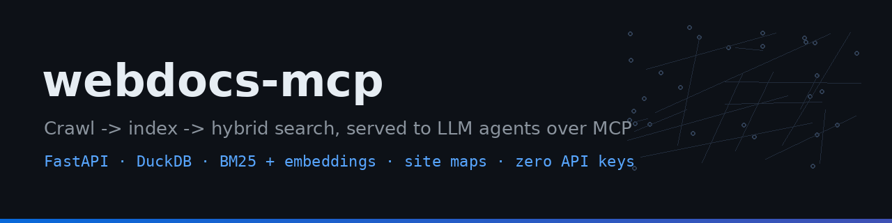
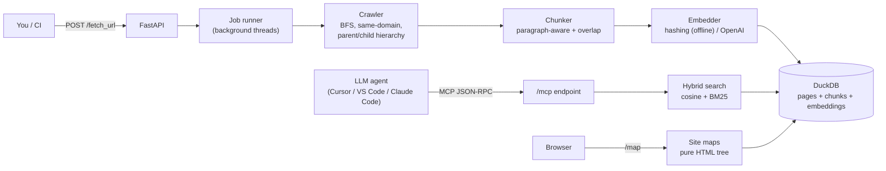

<p align="center">
  
</p>

<p align="center">
  <a href="https://github.com/saianthireddy/webdocs-mcp/actions/workflows/ci.yml"></a>
  
  
</p>

# 🩺 webdocs-mcp

Crawl any documentation site, index it into DuckDB with hybrid (semantic + BM25) search, and expose the whole thing to LLM agents as an **MCP server** — so your coding assistant reasons over *current* docs instead of its training cutoff.

Runs completely **offline by default**: the built-in hashing embedder needs no API key, and every test runs without touching the network. Set one environment variable to switch to OpenAI embeddings in production.

## Why

LLM agents hallucinate stale APIs. The fix is retrieval over the *actual* docs of the *actual* version you use. webdocs-mcp is the smallest honest stack that does this end to end: point it at a docs site, it crawls with hierarchy tracking, chunks and embeds every page, and serves `search_docs` / `get_doc_page` tools over the Model Context Protocol to Cursor, VS Code, or Claude Code.

## Architecture



Design choices worth calling out:

- **DuckDB over a vector-DB server** — a doc index for one team is thousands of chunks, not billions. One portable file, zero ops.
- **BM25 + embeddings, always both** — embeddings catch paraphrases ("how do I get my money back" → refund policy); BM25 catches exact identifiers (`ERR_LOCK_TIMEOUT`) that embeddings smear. Scores are min-max normalised and blended 60/40.
- **Injectable fetcher** — the crawler takes a plain `(url) -> html` callable. Tests inject a dict-backed fake site; production uses httpx; a headless browser slots in without touching crawl logic.
- **MCP implemented directly** — the streamable-HTTP core of MCP is JSON-RPC dispatch (`initialize`, `tools/list`, `tools/call`). Owning those ~100 lines keeps the stack dependency-light and fully offline-testable.
- **Threads now, Redis when needed** — jobs run on daemon threads behind a `JobManager` interface shaped like a queue consumer. docker-compose already ships the Redis service for the scale-out path.

## Quickstart

```bash
git clone https://github.com/saianthireddy/webdocs-mcp.git
cd webdocs-mcp

python -m venv .venv && source .venv/bin/activate
pip install -r requirements-dev.txt

pytest            # 23 tests, fully offline
ruff check src tests

PYTHONPATH=src uvicorn webdocs.api:app --port 9111
```

Then:

```bash
# start a crawl
curl -X POST localhost:9111/fetch_url -H 'Content-Type: application/json' \
     -d '{"url": "https://docs.astral.sh/ruff", "max_pages": 30}'

# watch progress
curl localhost:9111/job_progress

# search what was indexed
curl 'localhost:9111/search_docs?query=how+do+I+ignore+a+rule&top_k=3'
```

Interactive OpenAPI docs at `http://localhost:9111/docs`, site maps at `http://localhost:9111/map`.

## Docker

```bash
docker compose up --build
# app on :9111, index persisted in the webdocs-data volume
```

## MCP integration

Add to Cursor / VS Code / Claude Code MCP configuration:

```json
{
  "webdocs": {
    "type": "http",
    "url": "http://localhost:9111/mcp"
  }
}
```

Exposed tools:

| Tool | Purpose |
|---|---|
| `search_docs` | Hybrid search over every indexed chunk; returns text + source URLs |
| `list_doc_pages` | List indexed pages so the agent can pick one |
| `get_doc_page` | Full extracted text of one page |

## API reference

| Endpoint | Description |
|---|---|
| `POST /fetch_url` | Start a crawl job (`{url, max_pages?, max_depth?}`); `?sync=true` blocks until done |
| `GET /job_progress` | All jobs, or one via `?job_id=` |
| `GET /search_docs` | `?query=&top_k=` hybrid search |
| `GET /list_doc_pages` | Every indexed page |
| `GET /get_doc_page` | `?page_id=` full page text |
| `GET /map` | Index of crawled sites (pure HTML, no JS) |
| `GET /map/site/{root_id}` | Hierarchical tree of one site |
| `GET /map/page/{id}` | Page view with breadcrumbs, siblings, children |
| `GET /map/page/{id}/raw` | Raw extracted text |
| `POST /mcp` | MCP JSON-RPC (initialize, tools/list, tools/call) |
| `GET /health` | Status + page/chunk counts |

## Site maps

Crawled pages keep parent/child relationships, so `/map` renders a real navigable tree per site — breadcrumbs from root, sibling navigation, children listing — in pure HTML (no JavaScript). Pages fetched individually from the same domain group under one root.

## Configuration

All optional (see `.env.example`):

| Variable | Default | Meaning |
|---|---|---|
| `WEBDOCS_DB_PATH` | `data/webdocs.duckdb` | Index location (falls back to in-memory if unwritable) |
| `WEBDOCS_EMBEDDER` | `hashing` | `hashing` (offline) or `openai` |
| `OPENAI_API_KEY` | — | Only for `openai` embedder |
| `WEBDOCS_MAX_PAGES` / `WEBDOCS_MAX_DEPTH` | 50 / 3 | Crawl limits |
| `WEBDOCS_CHUNK_SIZE` / `WEBDOCS_CHUNK_OVERLAP` | 1200 / 150 | Chunking |

## Testing

```bash
pytest tests/ -v      # 23 tests: crawler, chunker, embedder, DB, hybrid search, API, MCP
```

No test touches the network — the crawler tests run against an in-memory fake site injected through the fetcher interface, and each test gets a throwaway DuckDB file.

## Roadmap

- [ ] Respect `robots.txt` and add per-domain rate limiting
- [ ] Incremental re-crawls (etag/last-modified) instead of full re-index
- [ ] Redis-backed worker pool using the existing compose service
- [ ] OCR/text extraction for linked PDFs
- [ ] DuckDB VSS extension (HNSW) once the index outgrows brute-force cosine

## License

MIT — see [LICENSE](LICENSE).
